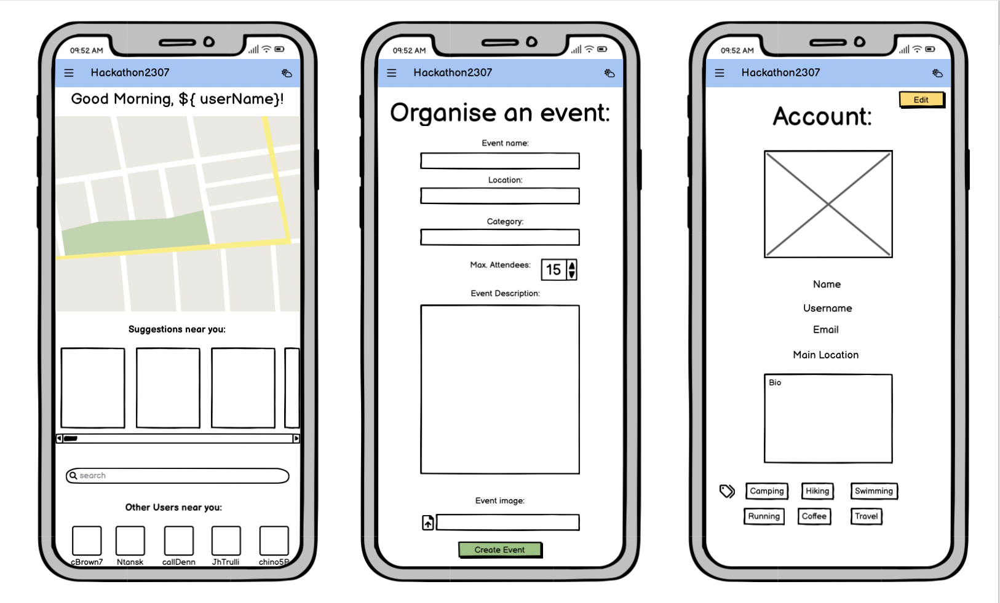
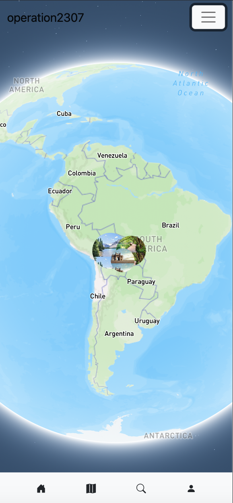

<h1 align="center"><strong>🌞🚵 SummerTrails 🏄🏖️</strong>
</h1>

## Deployment
#### _(please note, your team must also include the deployed links in the usual submission in Hackapp)_
The project is deployed and can be accessed at [http://your-deployed-link.com](http://your-deployed-link.com).

---
&nbsp;

## Criteria
In this section, we will briefly discuss how our team addressed the applicable criteria:

- ✨ Project is 100% Mobile First
- ✨ Project uses browser location or device camera
- ✨ Project aligns well to the Hackathon Theme
- ✨ Clear use of Github Projects or other agile tool
- ✨ Presentation Quality - Present as if you are pitching it to client

---
&nbsp;

## Intro

SummerTrails is a location-service app for users to share photos and pin them to their geo-location on a mapbox map for other users to see in real time.

Users can share where they have been over the summer and the many sights they have seen with other like-minded users.

---
&nbsp;

## Goal

The goal of this project is to connect people around the world during the summer where people are statistically most likely to travel and take holiday.

A [2014 census](https://aytm.com/post/vacations-survey) by Ask Your Target Market found that 59% of respondants said that they book their holidays in the Summer and 46% said they aim for the month of July.

We want to see users sharing cool views from different places on their travels, whether it be from a road trip to the countryside or a flight to a new destination.

Users will be able to see what others are up to and sharing and can also see recommended travel destinations around the world.

## UX Design Choices

- *Secure Login Page*: Users will be greeted with a login page to ensure that every person accessing the site must be logged in to post. This design choice helps regulate the content by ensuring that only registered users can create posts in the app. By requiring login credentials, we can maintain a safer and more controlled environment for posting.
- *Accessible Post Button*: To adhere to established mental maps and provide a user-friendly experience, we will make the post functionality easily accessible. A single red button will be placed at the bottom of the index page, ensuring that users can quickly locate and access the option to create a post. This design choice promotes ease of use and enhances app accessibility by offering clearly identifiable options.
- *Simple Post Form*: Upon clicking the post button, users will be presented with a straightforward form. This form will allow them to add a title, description, and picture to their current location on the globe. By keeping the form simple and focused, we can streamline the posting process and make it more intuitive for users to share their content.

- *Modal for Image Display*: The images added by the user will be displayed using a modal. By clicking on the marker created on the map, users can access the modal, which will showcase a list of the images associated with the post (up to a maximum of 3 images). Additionally, the modal will include the post's title and description. This design choice allows users to view the images and associated information in a focused and immersive manner.
- *Clear Close Button and Like Button*: Below each displayed image in the modal, a clear close button will be provided for users to easily close the modal and return to the map view. Additionally, a heart icon will serve as a like button. When clicked, the heart button will change color to red, indicating a successful like action. This visual feedback provides users with a clear indication of their interaction with the image.
- *Extra Menu for Reporting*: On the top left corner of the image display within the modal, an additional menu will be represented by three white dots. Clicking on these dots will open a menu with various options, including the ability to report an image in case of inappropriate content. This design choice ensures that users have a clear and accessible way to report any content that violates community guidelines or standards.

## Wireframes, ideas and planning

**Day 1:** We spent a lot of time on the first day discussing ideas based on the criteria set out by C.I.
Some great ideas off the bat included adding weather forecasts bases on your location, creating events for other users in your vicinity and search/fitering events/activities based on interests that authenticated users could save to a user profile.

The project was mapped out and followed on Github Projects.
A link to the project board can be found here: https://github.com/users/Robrowno/projects/6

We immediately knew we wanted to use the Mapbox API, and A first wireframe draft saw us modelling an app that was not too disimilar to the ROADS app by Porsche. An app where users can use their location to find interested local destinations, road trip ideas and meet up with other users who can share their own custom road trip routes.

**Day 2:** On day two, we refined our scope and realised we needed to streamline our focus on getting the frontend right before looking to different features. We went back to the drawing board and came up with an idea of having the map take up the entire screen space - globe front and centre! 

With some hard-coded data we even mapped out how pinned users would appear on the map when they upload an image from their lcoation:

**Day 3:** 

---

&nbsp;

## Tech

The following technology has been used for this application:

- Markup Languages: HTML5, CSS3
- Styling frameworks: Bootstrap v5.2
- Programming Languages: Javascript
- Frameworks: 
- Agile/Project-mapping: Github Projects, Github Issues
- Wireframes: Balsamiq
- IDE: VS Code
- Version Control: Git

### Testing 

- The project has been tested in Google Chrome on the following systems:

    - MacOS/Unix
    - Windows
    - iOS
    
---

&nbsp;

## Bugs/Issues

- We tried to set up a temporary fix for not pushing up our mapbox API early on, however, we had no success with this. We tried to `npm install dotenv` and set up a config.js file for storing out API key but we were not able to successfully import it into the index.js file.

- We had an canvas overflow issue from the nav bar which we solved by inspecting in the console and adding a z-index of 1 to one of the classes properties.

-----

&nbsp;

## Meet the Team

| Callum Dennis | Jhoan Trujillo | Christian Brown | Niclas Tanskanen | Chinonso Olejeme | Richard  |
| :---: | :---: | :---: | :---: | :---: | :---: |
|  |  |  |  |  |  |
| Developer 1 | Developer 2 | Developer 3 | Developer 4 | Developer 5 | Developer 6 |
| [Callum Dennis's LinkedIn](https://www.linkedin.com/in/callum-dennis-ireland/) | [Jhoan Trujillo's LinkedIn](https://www.linkedin.com/in/jhoan-trujillo-92b03517b/) | [ Christian Brown's LinkedIn](https://www.linkedin.com/in/christian-brown-ba7741171/) | [Niclas Tanskanen's LinkedIn](https://www.linkedin.com/in/niclastanskanen/) | [Chinonso Olejeme's LinkedIn](https://www.linkedin.com/in/olejeme/) | [Richard's LinkedIn](#) |

-----

&nbsp;

## Credits
We would like to give credit to the following individuals, organizations, and resources that have contributed to the project or provided inspiration:

- Colour palettes were taken from the trending section on the [Coolers](https://coolors.co/palette/000000-14213d-fca311-e5e5e5-ffffff) site

- The Map was able to be generated using the Mapbox API: [Mapbox API](https://docs.mapbox.com/mapbox-gl-js/example/custom-marker-icons/)

- The user interface was pre-designed and sketched using [Balsamiq](https://balsamiq.com) wireframing tool

-----

